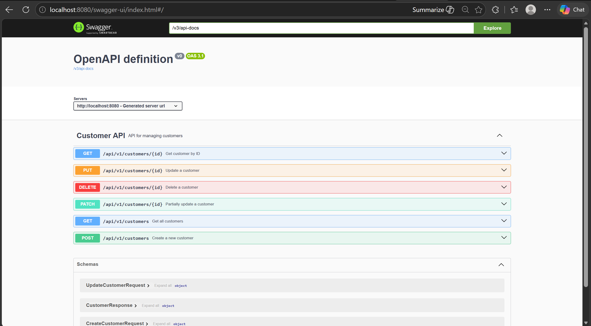

# 📘 Customer API Contract

## Base URL

```
/api/v1/customers
```

The API runs at `http://localhost:8080`.

Swagger UI:

```text
http://localhost:8080/swagger-ui/index.html
```

Swagger JSON:

```text
http://localhost:8080/v3/api-docs
```

---

# 🔹 1. Create Customer

## Method

POST

## URL

```
/api/v1/customers
```

## Description

Membuat customer baru.

## Request Body

```json
{
  "full_name": "John Doe",
  "email": "john@example.com",
  "phone_number": "08123456789"
}
```

## Success Response

```json
{
  "id": 1,
  "full_name": "John Doe",
  "email": "john@example.com",
  "phone_number": "08123456789",
  "updated_at": "2026-06-17T16:12:48.2818003",
  "created_at": "2026-06-17T16:12:48.2818003"
}
```

## Error Response

```json
{
  "success": false,
  "message": "Validation failed",
  "data": null,
  "error": "BAD_REQUEST",
  "details": ["email must not be blank"]
}
```

## Status Code

- 201 Created
- 400 Bad Request

---

# 🔹 2. Get All Customers

## Method

GET

## URL

```
/api/v1/customers
```

## Description

Mengambil seluruh data customer.

## Request Body

Tidak ada

## Success Response

```json
[
  {
    "id": 1,
    "full_name": "John Doe",
    "email": "john@example.com",
    "phone_number": "08123456789",
    "updated_at": "2026-06-17T16:12:48.2818003",
    "created_at": "2026-06-17T16:12:48.2818003"
  }
]
```

## Error Response

```json
[]
```

## Status Code

- 200 OK

---

# 🔹 3. Get Customer By ID

## Method

GET

## URL

```
/api/v1/customers/{id}
```

## Description

Mengambil data customer berdasarkan ID.

## Request Body

Tidak ada

## Success Response

```json
{
  "id": 1,
  "full_name": "John Doe",
  "email": "john@example.com",
  "phone_number": "08123456789",
  "updated_at": "2026-06-17T16:12:48.2818003",
  "created_at": "2026-06-17T16:12:48.2818003"
}
```

## Error Response

```json
{
  "success": false,
  "message": null,
  "data": null,
  "error": "Customer dengan id (1) tidak bisa ditemukan",
  "details": null
}
```

## Status Code

- 200 OK
- 404 Not Found

---

# 🔹 4. Update Customer (Full Update)

## Method

PUT

## URL

```
/api/v1/customers/{id}
```

## Description

Mengupdate seluruh data customer (full replace).

## Request Body

```json
{
  "full_name": "Jane Doe",
  "email": "jane@example.com",
  "phone_number": "08129876543"
}
```

## Success Response

```json
{
  "id": 1,
  "full_name": "Jane Mils",
  "email": "janemils@example.com",
  "phone_number": "08129876544",
  "created_at": "2026-06-17T16:12:48.2818003",
  "updated_at": "2026-06-17T16:25:32.1236787"
}
```

## Error Response

```json
{
  "success": false,
  "message": "Validation failed",
  "data": null,
  "error": "BAD_REQUEST",
  "details": ["phoneNumber size must be between 10 and 2147483647"]
}
```

## Status Code

- 200 OK
- 400 Bad Request
- 404 Not Found

---

# 🔹 5. Patch Customer (Partial Update)

## Method

PATCH

## URL

```
/api/v1/customers/{id}
```

## Description

Mengupdate sebagian data customer (partial update).

## Request Body

```json
{
  "email": "newemail@example.com"
}
```

## Success Response

```json
{
  "id": 1,
  "full_name": "John Doe",
  "email": "newemail@example.com",
  "phone_number": "08123456789",
  "created_at": "2026-06-17T16:12:48.2818003",
  "updated_at": "2026-06-17T16:25:32.1236787"
}
```

## Error Response

```json
{
  "error": "Customer dengan id (1) tidak bisa ditemukan"
}
```

## Status Code

- 200 OK
- 404 Not Found

---

# 🔹 6. Get Customer By Email

## Method

GET

## URL

```
/api/v1/customers?email=
```

## Description

Mengambil data customer berdasarkan Email.

## Request Body

Tidak ada

## Success Response

```json
{
  "id": 1,
  "full_name": "John Doe",
  "email": "john@example.com",
  "phone_number": "08123456789",
  "updated_at": "2026-06-17T16:12:48.2818003",
  "created_at": "2026-06-17T16:12:48.2818003"
}
```

## Error Response

```json
{
  "success": false,
  "message": null,
  "data": null,
  "error": "Customer dengan Email (john@example.com) tidak bisa ditemukan",
  "details": null
}
```

## Status Code

- 200 OK
- 404 Not Found

---

# ✅ Notes

- PUT = full update
- PATCH = partial update
- Validation berlaku di POST & PUT


