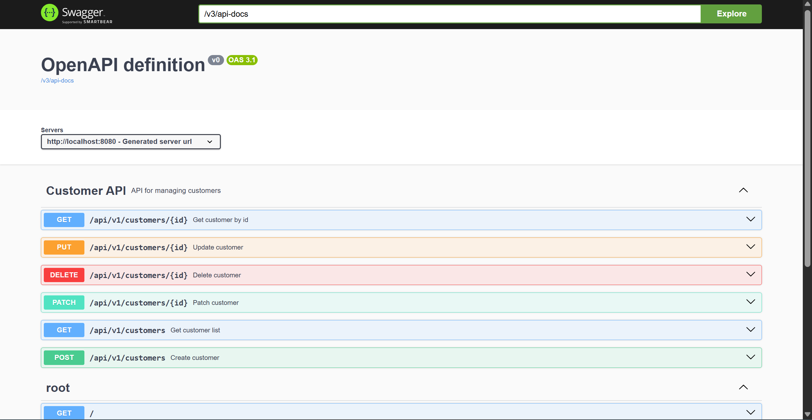

# Customer API Contract

Base URL: `/api/v1/customers`

---

## 1. Get Customers

**Method:** GET

**URL:** `/api/v1/customers`

**Description:** Get all customer data. This endpoint can also filter customers by optional query parameters `name` and `email`.

**Note:** Pagination query parameters are contract only and have not been implemented in the controller/service yet.

**Query parameters:**

- `name` optional, filter customers by full name
- `email` optional, filter customers by email
- `page` optional, page number for simple pagination, contract only
- `size` optional, number of data per page, contract only

**Example URL:**

`/api/v1/customers?name=john&email=john@example.com`

**Pagination example URL:**

`/api/v1/customers?page=1&size=10`

**Request body:** None

**Success response:**

```json
[
  {
    "id": 1,
    "full_name": "john doe",
    "email": "john@example.com",
    "phone_number": "081234567890",
    "created_at": "2026-06-17T10:00:00+07:00[Asia/Jakarta]",
    "updated_at": null
  }
]
```

**Success response with pagination contract:**

```json
{
  "data": [
    {
      "id": 1,
      "full_name": "john doe",
      "email": "john@example.com",
      "phone_number": "081234567890",
      "created_at": "2026-06-17T10:00:00+07:00[Asia/Jakarta]",
      "updated_at": null
    }
  ],
  "pagination": {
    "page": 1,
    "size": 10,
    "total_data": 25,
    "total_page": 3
  }
}
```

**Error response:**

```json
{
  "code": "INTERNAL_SERVER_ERROR",
  "message": "Error message",
  "errors": []
}
```

**Status code:**

- `200 OK`
- `500 Internal Server Error`

---

## 2. Create Customer

**Method:** POST

**URL:** `/api/v1/customers`

**Description:** Create a new customer.

**Request body:**

```json
{
  "full_name": "John Doe",
  "email": "john@example.com",
  "phone_number": "081234567890"
}
```

**Success response:**

```json
{
  "message": "Customer Created!",
  "data": {
    "id": 1,
    "full_name": "john doe",
    "email": "john@example.com",
    "phone_number": "081234567890",
    "created_at": "2026-06-17T10:00:00+07:00[Asia/Jakarta]",
    "updated_at": null
  }
}
```

**Error response:**

```json
{
  "code": "VALIDATION_EROR",
  "message": "INVALID REQUEST!",
  "errors": [
    {
      "field": "email",
      "message": "Email harus valid!"
    }
  ]
}
```

**Status code:**

- `201 Created`
- `400 Bad Request`
- `500 Internal Server Error`

---

## 3. Get Customer By ID

**Method:** GET

**URL:** `/api/v1/customers/{id}`

**Description:** Get one customer by ID.

**Request body:** None

**Success response:**

```json
{
  "id": 1,
  "full_name": "john doe",
  "email": "john@example.com",
  "phone_number": "081234567890",
  "created_at": "2026-06-17T10:00:00+07:00[Asia/Jakarta]",
  "updated_at": null
}
```

**Error response:**

```json
{
  "code": "CUSTOMER_NOT_FOUND",
  "message": "Customer not found with id: 1",
  "errors": []
}
```

**Status code:**

- `200 OK`
- `404 Not Found`
- `500 Internal Server Error`

---

## 4. Delete Customer By ID

**Method:** DELETE

**URL:** `/api/v1/customers/{id}`

**Description:** Delete customer by ID.

**Request body:** None

**Success response:** No content

**Error response:**

```json
{
  "code": "CUSTOMER_NOT_FOUND",
  "message": "Customer not found with id: 1",
  "errors": []
}
```

**Status code:**

- `204 No Content`
- `404 Not Found`
- `500 Internal Server Error`

---

## 5. Update Customer By ID

**Method:** PUT

**URL:** `/api/v1/customers/{id}`

**Description:** Update all customer fields by ID.

**Request body:**

```json
{
  "full_name": "John Doe Updated",
  "email": "john.updated@example.com",
  "phone_number": "081234567891"
}
```

**Success response:**

```json
{
  "message": "Customer data updated successfully",
  "data": {
    "id": 1,
    "full_name": "john doe updated",
    "email": "john.updated@example.com",
    "phone_number": "081234567891",
    "created_at": "2026-06-17T10:00:00+07:00[Asia/Jakarta]",
    "updated_at": "2026-06-17T10:30:00+07:00[Asia/Jakarta]"
  }
}
```

**Error response:**

```json
{
  "code": "CUSTOMER_NOT_FOUND",
  "message": "Customer not found with id: 1",
  "errors": []
}
```

**Status code:**

- `200 OK`
- `400 Bad Request`
- `404 Not Found`
- `500 Internal Server Error`

---

## 6. Patch Customer By ID

**Method:** PATCH

**URL:** `/api/v1/customers/{id}`

**Description:** Update only provided customer fields by ID.

**Request body:**

```json
{
  "email": "new.email@example.com"
}
```

**Success response:**

```json
{
  "message": "Customer data updated successfully",
  "data": {
    "id": 1,
    "full_name": "john doe",
    "email": "new.email@example.com",
    "phone_number": "081234567890",
    "created_at": "2026-06-17T10:00:00+07:00[Asia/Jakarta]",
    "updated_at": "2026-06-17T10:30:00+07:00[Asia/Jakarta]"
  }
}
```

**Error response:**

```json
{
  "code": "CUSTOMER_NOT_FOUND",
  "message": "Customer not found with id: 1",
  "errors": []
}
```

**Status code:**

- `200 OK`
- `400 Bad Request`
- `404 Not Found`
- `500 Internal Server Error`

---

## Swagger


